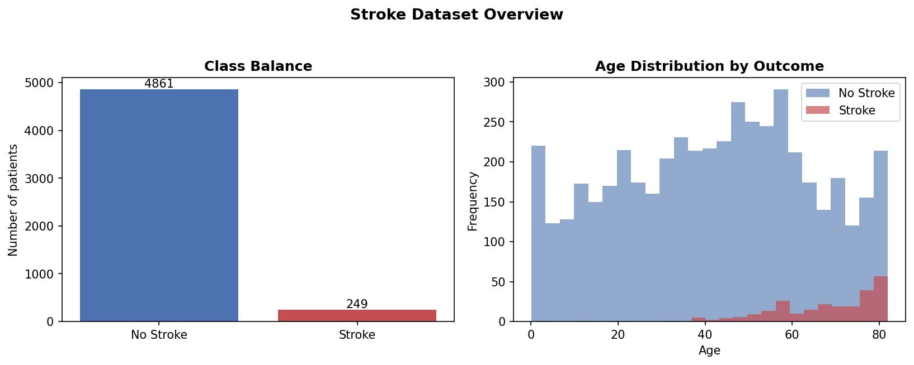
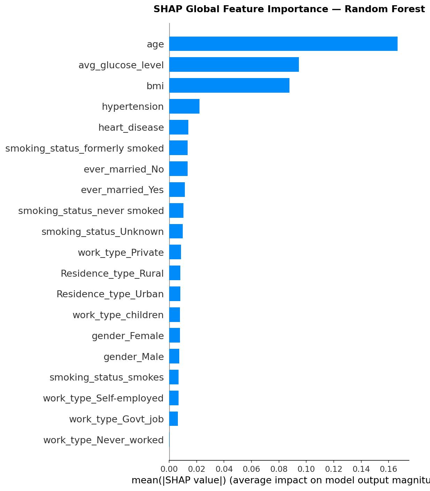
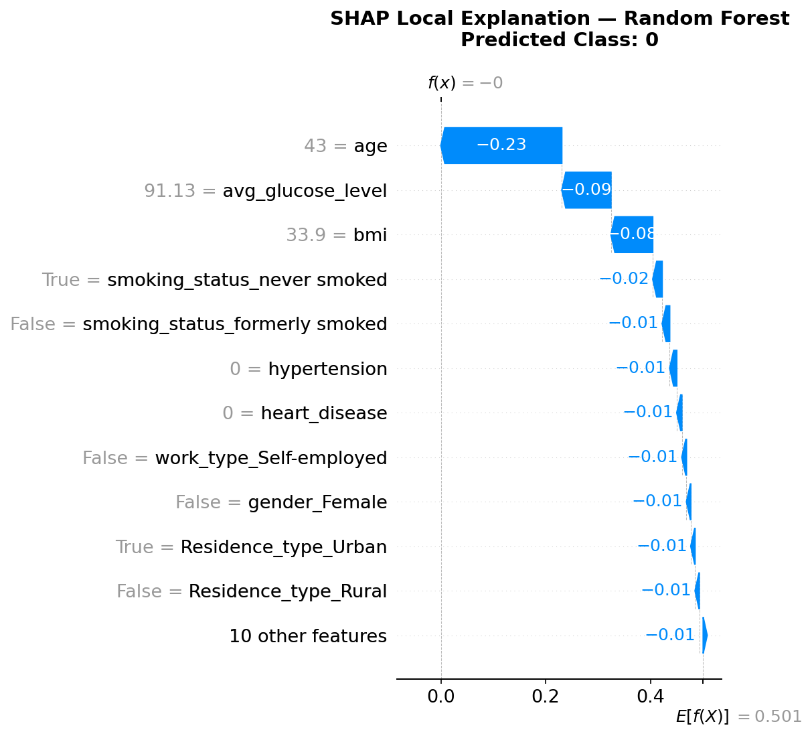

# Explainable Machine Learning

A hands-on exploration of model interpretability techniques applied to a real-world healthcare classification problem: predicting stroke risk from patient health data.

This project walks through the two major branches of Explainable AI (XAI) — **glassbox models** that are interpretable by design, and **post-hoc explanation methods** that explain the decisions of opaque "blackbox" models — using a consistent dataset and evaluation setup throughout.

## Overview

Predicting patient outcomes is only half the problem in healthcare machine learning; understanding *why* a model made a prediction is often just as important as the prediction itself. This repository demonstrates several complementary approaches to explainability, each implemented as a standalone, runnable notebook:

| # | Notebook | Technique | What it covers |
|---|----------|-----------|-----------------|
| 00 | `00_data_exploration.py` | Exploratory Data Analysis | Loading, inspecting, and visualizing the dataset; reviewing feature distributions |
| 01 | `01_interpretable_models.ipynb` | Glassbox models | Logistic Regression, a Classification Tree, and an Explainable Boosting Machine (EBM), each explained natively via [InterpretML](https://github.com/interpretml/interpret) |
| 02 | `02_lime.ipynb` | LIME | Local surrogate explanations for a Random Forest classifier |
| 03 | `03_shap.ipynb` | SHAP | Shapley-value-based local and global explanations for a Random Forest classifier, including force and waterfall plots |
| 04 | `04_counterfactuals.ipynb` | Counterfactual explanations | "What would need to change?" explanations for a Random Forest classifier using [DiCE](https://github.com/interpretml/DiCE) (random and genetic search methods) |

All blackbox-model notebooks (LIME, SHAP, and counterfactuals) explain the same underlying `RandomForestClassifier`, making it easy to directly compare how each method characterizes the same model's behavior.

## Sample Output

The figures below were generated directly from this repository's pipeline (`utils.py` → Random Forest → SHAP).

**Dataset overview** — class imbalance and age distribution by outcome:



**Global explanation** — which features drive the Random Forest's predictions overall, ranked by mean absolute SHAP value:



**Local explanation** — why the model made a specific prediction for one patient, shown as a SHAP waterfall plot:



## Dataset

The project uses the [Healthcare Stroke Prediction dataset](https://www.kaggle.com/datasets/fedesoriano/stroke-prediction-dataset) (`brain_mir/healthcare-dataset-stroke-data.csv`), which contains patient attributes such as age, average glucose level, BMI, hypertension and heart disease history, and lifestyle factors, with a binary label indicating whether the patient had a stroke.

Because the dataset is heavily imbalanced (stroke cases are rare), the pipeline applies random oversampling of the minority class on the training split before model fitting.

> **Note:** The `brain_mir` directory also includes a brain MRI tumor image dataset (training/testing splits across four tumor classes). This is not currently used by any notebook in this repository and is retained for potential future work on explainability for image-based models.

## Project Structure

```
explainable-machine-learning/
├── utils.py                        # DataLoader: loading, preprocessing, splitting, oversampling
├── 00_data_exploration.py          # EDA script (percent-cell format, runnable in Jupyter/VS Code)
├── 01_interpretable_models.py      # Script version of notebook 01
├── 01_interpretable_models.ipynb   # Glassbox models (Logistic Regression, Tree, EBM)
├── 02_lime.ipynb                   # LIME explanations for a Random Forest
├── 03_shap.ipynb                   # SHAP explanations for a Random Forest
├── 04_counterfactuals.ipynb        # Counterfactual explanations via DiCE
├── assets/                         # Sample output images used in this README
│   ├── data_overview.png
│   ├── shap_global_importance.png
│   └── shap_local_waterfall.png
└── brain_mir/
    ├── healthcare-dataset-stroke-data.csv
    ├── training/                   # Brain MRI images (unused, reserved for future work)
    └── testing/                    # Brain MRI images (unused, reserved for future work)
```

The `DataLoader` class in `utils.py` centralizes all data handling used across notebooks:
- `load_dataset()` — reads the CSV into a DataFrame
- `preprocess_data()` — one-hot encodes categorical features, imputes missing BMI values, and drops the identifier column
- `get_data_split()` — produces an 80/20 train/test split
- `oversample()` — balances the training set via random oversampling of the minority class

## Getting Started

### Prerequisites

- Python 3.9+
- Jupyter Notebook / JupyterLab (or an IDE with notebook support, e.g. VS Code)

### Installation

Clone the repository and install the required packages:

```bash
git clone https://github.com/<your-username>/explainable-machine-learning.git
cd explainable-machine-learning
pip install pandas scikit-learn imbalanced-learn interpret shap dice-ml matplotlib numpy
```

### Running the Notebooks

Launch Jupyter and run the notebooks in numerical order, as each builds on the same data pipeline established in `utils.py`:

```bash
jupyter notebook
```

1. Start with `00_data_exploration.py` to understand the dataset.
2. Run `01_interpretable_models.ipynb` to see interpretable-by-design models.
3. Run `02_lime.ipynb` and `03_shap.ipynb` to see post-hoc explanations of a Random Forest.
4. Run `04_counterfactuals.ipynb` to explore actionable, "what-if" style explanations.

## Techniques Used

- **[InterpretML](https://github.com/interpretml/interpret)** — glassbox models (Logistic Regression, Classification Tree, Explainable Boosting Machine) with built-in local and global explanation dashboards, plus a blackbox `LimeTabular` wrapper.
- **[SHAP](https://github.com/shap/shap)** — `TreeExplainer` for computing Shapley values on tree-based models, visualized with force plots and waterfall plots.
- **[DiCE](https://github.com/interpretml/DiCE)** — Diverse Counterfactual Explanations, generated via both random sampling and genetic search, showing minimal feature changes needed to flip a prediction.

## License

This project is intended for educational and research purposes. Please review the license terms of the [stroke prediction dataset](https://www.kaggle.com/datasets/fedesoriano/stroke-prediction-dataset) before any commercial use.

## Acknowledgments

- [InterpretML](https://interpret.ml/) by Microsoft Research
- [SHAP](https://shap.readthedocs.io/) by Scott Lundberg et al.
- [DiCE](https://interpretml.github.io/DiCE/) by Microsoft Research
